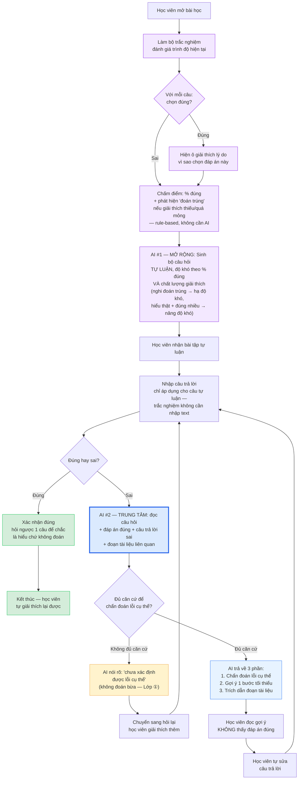

# Sơ đồ luồng — D2: Học từ lỗi trước (Productive Failure)

Nộp cho **CP2** (hạn 21:00 16/9) — GitHub tự render sơ đồ Mermaid bên dưới trực tiếp khi mở file này trên web.

Lát cắt 1 câu (tham chiếu `spec.md` §4, **quyết định AI trung tâm** — cái được đo ở CP3): *Một học viên · làm bài tập tự luận, làm sai · AI chẩn đoán đúng giả định sai cụ thể và gợi ý một bước tối thiểu kèm trích dẫn tài liệu (không đưa đáp án ngay) · học viên tự sửa và giải thích lại được.*

**Mở rộng (không phải quyết định trung tâm, làm nếu còn thời gian):** trước khi vào bài tự luận, học viên làm 1 bộ trắc nghiệm đánh giá trình độ hiện tại; mỗi câu chọn **đúng** sẽ hiện thêm ô giải thích lý do (lọc "đoán trúng" khỏi "hiểu thật"); hệ thống tự sinh bộ câu hỏi tự luận với độ khó tương ứng cả % đúng lẫn chất lượng giải thích.

*(Khối tím = phần mở rộng (trắc nghiệm → sinh tự luận thích ứng). Khối xanh đậm viền dày = quyết định AI trung tâm, cái duy nhất bắt buộc phải "chạy thật" ở CP3.)*

## Giải thích nhánh quan trọng

- **Ô giải thích khi chọn đúng** (A1b→A1c): chọn đúng đáp án chưa chắc là hiểu đúng bản chất (có thể đoán trúng) — nên chỉ hỏi thêm ở đúng chỗ mơ hồ nhất (khi chọn đúng), không bắt giải thích mọi câu.
- **Trắc nghiệm chấm bằng rule, không cần AI** (A2): % đúng chỉ cần so khớp đáp án có sẵn; phần "phát hiện đoán trúng" cũng chỉ cần rule đơn giản (VD giải thích < 15 ký tự hoặc để trống → nghi ngờ), không cần AI để làm bước này.
- **AI #1 (sinh câu tự luận theo độ khó)**: nhận input là % đúng trắc nghiệm + chất lượng giải thích + bài học hiện tại, output là bộ câu hỏi tự luận. Đây là phần **mở rộng**, không phải quyết định bắt buộc đo ở CP3.
- **AI #2 (chẩn đoán lỗi) — quyết định trung tâm**: giữ nguyên thiết kế cũ, đã có evidence khảo sát (60.9% xác nhận pain đúng ở khâu này — xem `spec.md` §1).
- **Nhánh "Đúng"**: không kết thúc ngay — AI hỏi ngược 1 câu để chắc chắn học viên hiểu chứ không phải đoán trúng.
- **Nhánh "Không đủ căn cứ"** (màu vàng): nếu tài liệu không đủ để xác định đúng loại lỗi, AI phải nói rõ thay vì bịa (Lớp ① — Nguồn sự thật, `01-challenge-brief.md`).
- **Vòng lặp** (F→G→H→B và I→J→K→B): học viên có thể sai nhiều lần, mỗi lần được gợi ý dẫn dắt chứ không cho đáp án ngay.

## Vì sao tách "quyết định trung tâm" khỏi phần mở rộng

`01-challenge-brief.md` yêu cầu lát cắt đúng format **"một quyết định AI"** (số ít). Luồng này có 2 lời gọi AI (sinh tự luận + chẩn đoán lỗi) — để không phạm format và không tốn thời gian xây cả 2 phần cho CP3, nhóm ưu tiên build AI #2 (chẩn đoán lỗi) trước vì đã có bằng chứng khảo sát rõ nhất (`spec.md` §1: 11/23 người nói đáp án hiện tại "chỉ nói sai rồi, không giải thích"). AI #1 (sinh trắc nghiệm/tự luận thích ứng) làm thêm nếu còn thời gian sau khi AI #2 chạy ổn.

## Trạng thái CP2 hiện tại

- ✅ Flow chính bấm được (bản mock): [`codebase/mock-cp2.html`](mock-cp2.html)
- ✅ Sơ đồ luồng (file này) — thể hiện đủ cả phần mở rộng lẫn nhánh an toàn
- Chưa cần AI chạy thật ở mốc này — CP3 cần lời gọi AI thật ở khối **AI #2 (viền xanh đậm)**.
