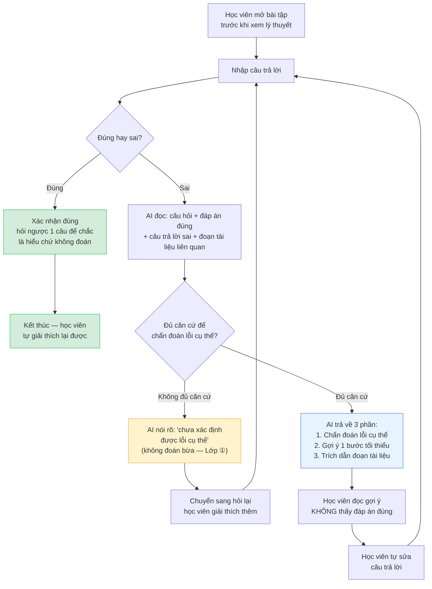

# Sơ đồ luồng — D2: Học từ lỗi trước (Productive Failure)

Nộp cho **CP2** (hạn 21:00 16/9) — GitHub tự render sơ đồ Mermaid bên dưới trực tiếp khi mở file này trên web.

Lát cắt 1 câu (tham chiếu `spec.md` §4): *Một học viên · làm bài tập trước khi xem lý thuyết, làm sai · AI chẩn đoán đúng giả định sai cụ thể và gợi ý một bước tối thiểu kèm trích dẫn tài liệu (không đưa đáp án ngay) · học viên tự sửa và giải thích lại được.*

## Giải thích nhánh quan trọng

- **Nhánh "Đúng"**: không kết thúc ngay — AI hỏi ngược 1 câu để chắc chắn học viên hiểu chứ không phải đoán trúng (tránh đo nhầm "may mắn" thành "học được").
- **Nhánh "Không đủ căn cứ"** (màu vàng): đây là ranh giới an toàn quan trọng nhất của prototype — nếu tài liệu không đủ để xác định đúng loại lỗi, AI phải nói rõ thay vì bịa ra 1 chẩn đoán sai khiến học viên tin nhầm càng nặng hơn (đúng nguyên tắc "Lớp ① — Nguồn sự thật" trong `01-challenge-brief.md`).
- **Vòng lặp** (F→G→H→B và I→J→K→B): đúng tinh thần "học từ lỗi" — học viên có thể sai nhiều lần, mỗi lần đều được gợi ý dẫn dắt chứ không phải cho đáp án ngay lần đầu.

## Trạng thái CP2 hiện tại

- ✅ Flow chính bấm được (bản mock): [`codebase/mock-cp2.html`](mock-cp2.html)
- ✅ Sơ đồ luồng (file này) — bổ sung, thể hiện rõ cả nhánh an toàn mà bản mock (linear) không thể hiện hết
- Chưa cần AI chạy thật ở mốc này — CP3 mới cần lời gọi AI thật ở đúng ô "AI đọc..." → "AI trả về 3 phần..." trong sơ đồ trên.
